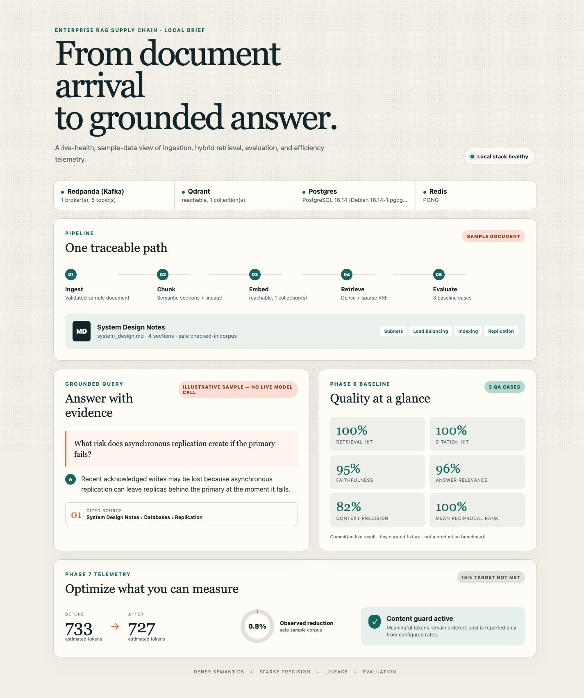

# Enterprise RAG Supply Chain

A laptop-runnable vertical slice that turns technical documents into fresh,
lineage-aware hybrid search results and cited Claude answers, with regression
evaluation and honest efficiency telemetry.

## Architecture

```text
                         asynchronous supply chain
 inbox/file ──> Redpanda documents.raw ──> semantic chunker ──> chunks.embed
                                                               │
                              Postgres lineage <── Celery/Redis │
                                      │                 │       │
                                      └── stale purge ──┴──> Qdrant
                                                             dense+sparse
                                                                  │
 question ──> local query embedding ──> Qdrant RRF retrieval ─────┤
                                                                  v
                                                        Claude + citations
                                                                  │
                                                        QA eval / telemetry
```

The normal pipeline is Kafka/Celery based. `make demo` is a synchronous
one-shot orchestration of the same validation, chunking, normalization,
embedding, Qdrant, lineage, query, and evaluation functions so it is easy to
reproduce without supervising background consumers.

## Setup

Requires Python 3.11+, Docker Compose, and Claude authentication. The first
embedding run may download `BAAI/bge-small-en-v1.5` from Hugging Face.

```shell
python3.11 -m venv .venv
.venv/bin/pip install -e '.[dev]'
cp .env.example .env             # first setup only; do not overwrite a configured .env
docker compose up -d
make health
```

Set `ANTHROPIC_API_KEY` in `.env` (or use a supported authenticated profile).
All four services must be healthy: Redpanda, Qdrant, Postgres, and Redis.

## One-shot demo

```shell
make demo
```

The command indexes `sample_docs/system_design.md`, runs one cited query, then
evaluates `eval/qa-v1.json`. Its JSON output reports chunk/upsert counts,
observed normalization reduction and whether the 15% target was met, query
citations and API-reported usage, and aggregate evaluation metrics. It exits 2
with a dependency hint if services, model files/network, or Claude credentials
are unavailable. It makes live generation and judge calls.

## Article dashboard

Launch the read-only local dashboard, then open the printed URL:

```shell
make dashboard
# http://127.0.0.1:8765
```

It combines live local-service health with clearly labeled safe sample data,
the committed Phase 6 scores, and a deterministic Phase 7 normalization
measurement. The displayed answer is explicitly illustrative and makes no
hidden model call. For a reproducible article capture, use a 1440×1100 browser
viewport, reload after all service cards settle, and capture the full page. The
page is responsive, self-contained, and loads no external fonts, scripts, or
analytics.



## Normal asynchronous path

Run these in separate terminals:

```shell
.venv/bin/celery -A rag_supply_chain.workers.celery_app worker --loglevel=info
.venv/bin/rag-embed
.venv/bin/rag-chunk consume
```

Then submit and query a document:

```shell
.venv/bin/rag-ingest process sample_docs/system_design.md
.venv/bin/rag-query "What risk does asynchronous replication create if the primary fails?"
```

Successful logs show the document routed to `documents.raw`, chunks produced,
a batch dispatched, and the Celery task returning its upsert and normalization
metrics. The query prints a cited answer plus provider-reported input/output
tokens. USD cost stays `null`/unavailable unless current prices are explicitly
set in `.env`; prices are never hard-coded because they change and may differ by
account. Cached-token usage is reported, but cost remains unknown without cache
pricing support.

## Pruning measurement and quality guard

Pre-embedding normalization removes only whitespace and unambiguous page-marker
or separator lines. A deterministic invariant verifies that all other
alphanumeric content tokens remain in order; violation fails the batch rather
than silently pruning content.

```shell
.venv/bin/rag-optimize sample_docs/system_design.md
```

This standalone command uses a deterministic token estimate. `make demo` and
the embedding worker report counts from the actual embedding tokenizer. The
15% reduction is a target, not a claim: `target_met` is based on the observed
input and may honestly be false. Retrieval/evaluation metrics provide the
downstream quality check after re-indexing normalized content.

## Evaluation and baseline

`eval/results-local.json` is the preserved Phase 6 live baseline candidate.
Normal runs write a separate ignored file so the baseline is not overwritten:

```shell
make eval
.venv/bin/rag-eval run --skip-judge --min-retrieval-hit-rate 1.0
```

The evaluator records deterministic retrieval hit rate, reciprocal rank,
expected-source precision, citation hit rate, Claude-judge faithfulness,
answer relevance, context precision, and API-reported token/cost telemetry.
Exit 1 means the explicit retrieval gate failed; exit 2 means a dependency
failure. Full multi-metric baseline comparison/tolerance policy remains Phase 6
follow-up work; the saved result is not silently treated as a universal gate.

## Cleanup

Stop foreground workers with Ctrl-C, then:

```shell
.venv/bin/rag-registry sample_docs/system_design.md
docker compose down
```

To permanently delete all project service volumes, use `docker compose down -v`.

## Verified operational evidence

The committed Phase 6 run contains three QA cases with retrieval hit rate and
MRR of 1.0, citation hit rate of 1.0, faithfulness about 0.95, answer relevance
0.96, and context precision about 0.817. These are results for the tiny checked-in
fixture, not broad production claims. No 15% pruning or dollar-savings claim is
made until a representative corpus measurement supports it.
